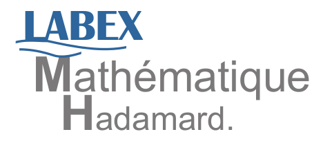

Welcome to the mathematical summer school "Structured Regularization for High-Dimensional Data Analysis".

Where and when
===========================

The summer school will take place from June 19th to 23rd in [Institut Henri Poincaré](http://www.ihp.fr/), in Paris, France.

Registration
===========================

[Registration is free but mandatory](https://docs.google.com/forms/d/e/1FAIpQLSfMXGWpODj9OdE8iT-PPlPkOaI3-v6SSYyKdrXTZ33m_oJZwA/viewform).

Topics
===========================

This mathematical summer school will be the opportunity to bring together students, researchers and people working on High-Dimensional Data Analysis around three courses and four talks on new methods in structured regularization. The mathematical foundations of this event will lie between probability, statistics, optimization, image and signal processing.

Speakers
===========================

Courses:

- [Anders Hansen](http://www.damtp.cam.ac.uk/research/afha/anders/) (Cambridge)
- [Andrea Montanari](http://web.stanford.edu/~montanar/) (Stanford)
- [Lorenzo Rosasco](http://web.mit.edu/lrosasco/www/) (Genova and MIT)

Additional talks:

- [Francis Bach](http://www.di.ens.fr/~fbach/) (INRIA and ENS)
- [Emilie Chouzenoux](http://www-syscom.univ-mlv.fr/~chouzeno/) (Paris Est)
- [Carlos Fernandez-Granda](http://www.cims.nyu.edu/~cfgranda/) (NYU)
- [Rachel Ward](https://www.ma.utexas.edu/users/rachel/) (UT Austin)

Organizers
===========================

- [Gabriel Peyré](http://www.gpeyre.com/)  (CNRS and ENS)
- [Guillaume Lecué](http://lecueguillaume.github.io/) (CNRS and ENSAE)
- [Yohann De Castro](https://www.normalesup.org/~decastro/) (Paris-Sud)

Supported by
===========================

&nbsp;&nbsp;&nbsp;

&nbsp;&nbsp;&nbsp;

&nbsp;&nbsp;&nbsp;

&nbsp;&nbsp;&nbsp;

